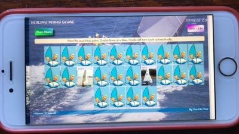

#   Milestone Project 2 

##  _Interactive Front End Development Project_

<!--  -->

***

# Pairs game to help teach aspects of sailing and associated knowledge to kids.

### Note to assessors on Project Submission relating back to MP1

>As well as producing this project for MP2, during this module I have also taken my MP1 project forward to a deployed Commercial Site (www.mlbowen.com on GitHub Pages) based on incorporating some of the other learning objectives for the last two modules not included in this project, in particular the coding and deployment of EmailJS and the inclusion of the Google Analytics API, as well as other improvements based on the UX feedback from the Assessors.

 

## Background Description

This product is a Pairs Matching game (also known as Pelmanism) with one set of cards in this first iteration. It has the following main objectives:

* To enhance kid's memory, observational and image recognition skills, along with speed if desired.
* At the same time expand their vocabulary on dinghy types in this first case, but in the future, as set out below, a wider range of sailing knowledge.
* To have fun in the process.

To play the game click on this link and have fun : https://kieronoc.github.io/CI-MP2/

 

## Code

Technical commentary on the code itself has been put as comments in the code files, particularly the Javascript File to explain what is going on.

The Code Files are structured as follows :

 * CI-MP2
   * README
   * index.html
   * assets
     * background
       * GTmetrix-report-kieronoc.github.io-20210421T153116-BccTotoG.pdf
       * [MP2 - Planes Analysis.pdf](https://github.com/KieronOC/CI-MP2/blob/master/assets/background/MP2%20-%20Planes%20Analysis.pdf)
     * css
       * style.css CSS File
     * images
         * Card image files
     * js
         * script.js Javascript file. (There is only one)
     * testing
        * Testing images
        * Lighthouse report

 

## 1 Overall Principle of the game

The objective is to find all the matching pairs of face down cards as fast as possible. By trial and error to start with, but then by remembering where pervious unmatched selections were located.

 

## 2. UX

I produced a Planes Analysis before starting the project, which sets out the purpose and objectives of the project and intended key design elements and code logic. This document can be read by clicking this link and in part covers some aspects not covered in this document itself:

 * [Sailing Pairs Game - Planes Analysis](https://github.com/KieronOC/CI-MP2/blob/master/assets/background/MP2%20-%20Planes%20Analysis.pdf)

I also constructed a basic wireframe document prior to starting to write the code, which is set out in the above document.

The site works for:

* Mobile
* Tablet
* Desktop

It has been designed to work in both Landscape and Portraint orientation for Mobiles and Laptops, such that the screen does not have to scrolled when playing the game. (See next )

### Resizing

The main feature of the game, the cards themselves, have been designed to resize to a small mobile. On a small mobile the images are identifiable and the text name at the top of the card helps, but more work is needed to consider how to make the images for the learning objectives of this application clearer at smaller sizes. (This issue is referenced in Bugs below.)

 

## 3. Features

> ### 3.1 Existing Features
>
The site / game has the following main features :

<u>Starting Page</u>

- Start page with kid friendly graphics and images.
- A 24 hour clock with timezone to stimulate curiosity.
- A short set of game instructions.
- 3 buttons to allow the user to select a slow (2 seconds), medium (1 second) or fast (0.5 second) rate at which the cards get turned back over, after two mismatched cards have been chosen.
- A clear Start button called 'Starting Gun', which is a sailing term, which when pressed will start the game.
- A Main Page button to allow the user to return to the starting page at any time and start a new game.
- The main page button does not start the game itself, only pressing the starting gun button will do that, which in turn starts the game timer, which is underneath the clock, top right of screen.

<u>Game Page</u>

- Game page with kid friendly graphics on the card backs.
- The Title, clock, Main menu, game timer and footer remain in view to leave maximum space for the cards.
- The game timer has started by the time this screen is loaded.
- A selection of 24 cards (12 pairs) is presented to the player with a short instruction line (see UI below) as to what to do.
- The player can only select two cards at time. If they match the cards dissappear from the screen. If they do not match, the images are hidden again after a period of time set out on the starting page above
- Once all 12 pairs have been found the page displays the Game Over Page below.

<u>Game Over Page</u>

- Game finisg page with kid friendly graphics and images
- The Title, clock, Main menu, game timer and footer remain in view.
- As soon as the last pair are found this page appears and the timer stops.
- A well done message appears with the time it took the player to play the game and encouraging them to have another go.

 

> ### 3.2 Features Left to Implement
>
There are some immediate features that I will implement first :

* The footer could be remove on this page in future to enable further increases in card sizes for smaller devices.
* The game screen could have a Start Game at the top, which activates the game and timer at that point so that the user has more visual acclimatisation time before starting. Alternatively have the timer start as soon as the first card is selected which is my preferred option.

As per the Planes analysis above there are further features left to implement that will make this a better game and learning tool :

The most immediate next steps are to:

 - [ ] Produce further sets of pairs cards by subject areas:
    * [ ] Sail parts
    * [ ] Boat parts
    * [ ] Knot types
    * [ ] Cloud formations
    * [ ] Basic rules
    * [ ] and probably others

These can be added by adding an object array of images in the same way that has been done in the Javascript File for the current version

Selection buttons can be added to the start page for the user to choose which subject they would like to play the game with.

A logical development process from this version is set out in the Planes Analysis.

 

## 4. Technologies Used

| No. 	| Code Area 	| Code Source 	| Comment 	|
|-----	|-----------	|-------------	|---------	|
| 1.  	|Bootstrap 4          	| www.bootstrap.com	            	|For layout and styling.         	|
| 2.  	|Fontawesome          	|www.fontaweseome.com         	|         	|
| 3.  	|HTML          	|	             	|For game layout         	|
| 4.  	|CSS          	|             	|For overriding Bootstrap and creating specific styles.         	|
| 5.  	|Javascript          	|             	|For running game logic and changing HTML and CSS in line with user decisions and game progress.         	|
| 6.    |Google Fonts|https://developers.google.com/fonts|Surfer font|

 

## 5. Testing

>### <u>User Interface</u>

Several friends, family and my mentor accessed the site and played the game. I attach a photo of a 9 year old UI test !

The main UI feedback from the wide age range is as follows:

* The younger age when presented with the Game Start page and no instructions as to what to do, figured out within 20 seconds the buttons that had to be selected. They selected a speed and pressed the Starting Gun. As soon as the game window opened they immediatedly started clicking cards. This test was done with a 6 second delay on re hiding unmatched cards. As soon as two cards were seem not to match this user instantly attempted to hide face up cards in order to turn them over again and keep playing. The feedback from this was :
   * Shortening the automatic times to 3secs, 2 secs and 0.5 secs for the Slow, Medium and Quick buttons on the Game Home page
   * Add a Play at your own pace button so that you can click the cards to re hide them yourself
   * Change the background image to something more fun

These suggestions will be coded into the next iteration.

* An older person one pressing the Starting Gun was not sure what to do once faced with the array of cards, so the current short instruction was added to the top the cards array which needs a little further adjustment.

* Another adult commented as follows; "Works well - I could find the different boats no problem on my small screen - fast level is VERY fast!!" So perhaps a consideration is to allow the user to enter the number of seconds delay they want for themselves with a default delay if nothing entered. 

* The Main Menu button was originally labelled New Game which caused some confusion with the Starting Gun button in terms of which button was needed to start the game so this was changed.

Other observations from testing it myself are :

* Making even better use of screen space on smaller screen sizes
* Having cards slightly expand in size on opening to make it easier to see them whilst not masking their location, which is he key part of solving the game.
* More work is needed to make a more seemless transition between different screen sizes. It is relatively smooth, the main issue is flipping between landscape and portfolio view on larger mobile devices.
* It was also noted that Chrome Developer Tools does not appear to create an accurante emulation of some devices as there were notable space useage issues after testing on a real device, which were then corrected. (see Browser and Device validation below)

 

 

>### <u>Code Validation</u>

I have tested the code as follows:

1. Manually myself by playing the game repeadetly with Chrome Developer Tools open to see the Javacript outputs doing as they were intended.
2. I have gone through and put comprehensive notes in the code for the purposes of this submission to ensure a full understanding of the flow.
3. My mentor pointed out a few issues with the use of VAR variables and quotation marks, which have been fixed.
4. All Console.Log statements have been removed.
5. Each language type has been put through the following code validators:

     * HTML :https://validator.w3.org/#validate_by_input
     * CSS  :http://jigsaw.w3.org/css-validator/
     * JS   :https://jshint.com/
     * JS   :https://beautifier.io/ (On the recommendation of my mentor)

    All the errors found in these checks have been corrected to the best of my current abilities. All warnings in connection with CDNs have not been dealt with.

#### Bugs

There are a few bugs that I have noted that need attention, but that I am not sure how to fix at this point :

 * The time reported in the 'game over' window in the message is 1 second different from the stopped timer clock at the top of the page.
 * The digital clock changes position very slightly as the numbers change.
 * The transition from one screen size to another needs to be made smoother. The main problem arises on change from landscape to portrait on the taller mobile phone versions.

>### <u>Browser and Device Validation</u>

I have loaded the site via the GitHub URL (https://kieronoc.github.io/CI-MP2/) onto :

* Google Chrome
* Microsoft Edge
* Firefox
* Safari

The website appears to work on all these platforms without any issues, including re-sizing.

I have also reviewed the website on:

* Iphone 6
* Ipad
* Widescreen desktop
* Laptop

The site functionality appears to be OK on all these platforms with the whole site re-sizing on all screen sizes (See Bugs under code validation above.)

The following are sample photos of testing on an Iphone and Ipad in Landscape mode. The /assets/testing folder contains photos of portrait orientations.

 

>
>Iphone 6-Start screen Landscape

>
>Iphone 6-Game page Landscape

>
>Ipad- Start screen Landscape

>
>Ipad- Game screen Landscape

 

>### <u>Performance Test</u>

I ran a performance test in Lighthouse and report is at this URL :

https://googlechrome.github.io/lighthouse/viewer/?psiurl=https%3A%2F%2Fkieronoc.github.io%2FCI-MP2%2F&strategy=mobile&category=performance&category=accessibility&category=best-practices&category=seo&category=pwa&utm_source=lh-chrome-ext

If for any reason that link fails the results were as follows :

* Performance 92%
* Accessiblity 100%
* Best Practices 100%
* SEO 91%

 

 

I also ran a performance test at gtmetrix.com with the results in the /assets/background/ folder of this GitHub repository for this site : GTmetrix-report-kieronoc.github.io-20210421T153116-BccTotoG.pdf

Suggestions in this report will need more knowledge to implement but it seems there are no glaring problems at this stage.

 

## 6. Deployment

I have pushed all the code to GITHUB and have published the main branch (there is only a main branch) at https://kieronoc.github.io/CI-MP2/

I am the only contributor.

This link opens the website from all the devices I have tested it on and that other user have opened it from here as well without any reported problems.

 

## 7. Credits

I have put specific citations in notes in the Javascript, HTML and CSS files that show where specific learning was obtained to be able to write the code.Except where noted all the code was written from scratch with the only 'copied and pasted'code being the Code Institute template and the CDN Scripts for Bootstrap, Fontawesome and Google Fonts.  

> ### 7.1 Primary Code References

| No. 	| Code Area  	| Code Source 	| Comment 	|
|-----	|---------------	|-------------	|---------	|
| 1.  	|HTML, CSS & Bootstrap          	| www.w3schools.com	            	|Beyond the knowledge learnt on the course so far, I used this site a lot to understand how to do small things with the code such as align and center information in the grid. More specific references are noted in the code.         	|
| 2.  	|Bootstrap         	|https://getbootstrap.com             	|To learn how to use the code attributes and understand how they worked and could be applied.         	|
| 3.  	|Javascript         	|https://developer.mozilla.org/en-US/docs/Web/JavaScript             	|To learn how to use the code attributes and understand how they worked and could be applied.         	|

jQuery was not used in this project.

 

> ### 7.2 Media

| No. 	| Subject	| Code Source 	| Comment 	|
|-----	|-----------	|-------------	|---------	|
| 1.  	|Background image   	| KJOC Photo            	|Royalty free picture used in background for non commercial use.         	|
| 2.  	|Illustration          	|https://www.netclipart.com         	|Non Commerical use       	|
| 3.  	|Images           	|Various internet sources         	|Royalty free picture used in background for non commercial use.|

 

> ### 7.3 Content

All the word content was written by Kieron O'Connell

> ### 7.4 Acknowledgements

I acknowledge all the help of the Code Institute Tutors and mentor, Aaron, for their help so far. As well as the help from fellow students via Slack.

END
